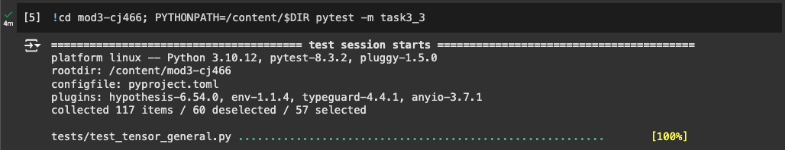
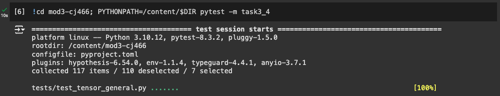
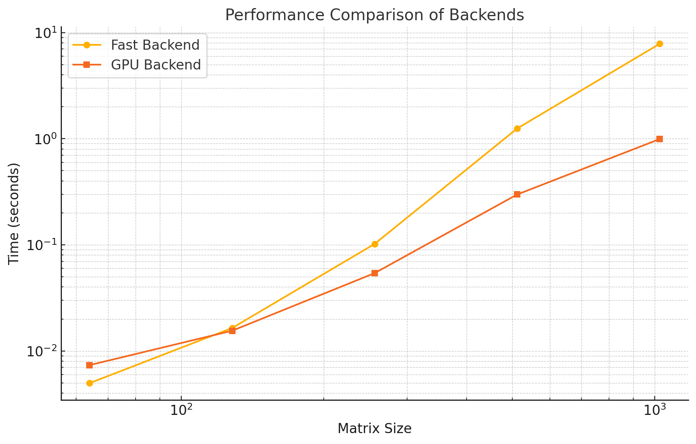

# MiniTorch Module 3


* Docs: https://minitorch.github.io/

* Overview: https://minitorch.github.io/module3.html


You will need to modify `tensor_functions.py` slightly in this assignment.

* Tests:

```
python run_tests.py
```

* Note:

Several of the tests for this assignment will only run if you are on a GPU machine and will not
run on github's test infrastructure. Please follow the instructions to setup up a colab machine
to run these tests.

This assignment requires the following files from the previous assignments. You can get these by running

```bash
python sync_previous_module.py previous-module-dir current-module-dir
```

The files that will be synced are:

        minitorch/tensor_data.py minitorch/tensor_functions.py minitorch/tensor_ops.py minitorch/operators.py minitorch/scalar.py minitorch/scalar_functions.py minitorch/module.py minitorch/autodiff.py minitorch/module.py project/run_manual.py project/run_scalar.py project/run_tensor.py minitorch/operators.py minitorch/module.py minitorch/autodiff.py minitorch/tensor.py minitorch/datasets.py minitorch/testing.py minitorch/optim.py

## Task 3.1 & 3.2Parallel Check Diagnostics Output
```
MAP

================================================================================
 Parallel Accelerator Optimizing:  Function tensor_map.<locals>._map,
/Users/ivanjie/workspace/mod3-cj466/minitorch/fast_ops.py (163)
================================================================================


Parallel loop listing for  Function tensor_map.<locals>._map, /Users/ivanjie/workspace/mod3-cj466/minitorch/fast_ops.py (163)
----------------------------------------------------------------------------------------------------------|loop #ID
    def _map(                                                                                             |
        out: Storage,                                                                                     |
        out_shape: Shape,                                                                                 |
        out_strides: Strides,                                                                             |
        in_storage: Storage,                                                                              |
        in_shape: Shape,                                                                                  |
        in_strides: Strides,                                                                              |
    ) -> None:                                                                                            |
        # Check if the output and input tensors are stride-aligned and have identical shapes              |
        if (                                                                                              |
            (out_strides == in_strides).all()-------------------------------------------------------------| #0
            and (out_shape == in_shape).all()-------------------------------------------------------------| #1
            and len(out_shape) == len(in_shape)                                                           |
        ):                                                                                                |
            for ord in prange(len(out)):------------------------------------------------------------------| #2
                out[ord] = fn(in_storage[ord])                                                            |
            return                                                                                        |
                                                                                                          |
        # General case: Handle broadcasting and indexing for misaligned or differently shaped tensors.    |
        for out_ord in prange(len(out)):------------------------------------------------------------------| #3
            # Convert the flat index in the output tensor to a multi-dimensional index                    |
            out_index = out_shape.copy()                                                                  |
            to_index(out_ord, out_shape, out_index)                                                       |
                                                                                                          |
            # Broadcast the output index to the corresponding input index                                 |
            in_index = in_shape.copy()                                                                    |
            broadcast_index(out_index, out_shape, in_shape, in_index)                                     |
                                                                                                          |
            # Convert the input multi-dimensional index back to a flat index                              |
            in_ord = index_to_position(in_index, in_strides)                                              |
                                                                                                          |
            # Apply the function to the input value and store the result in the output tensor.            |
            out[out_ord] = fn(in_storage[in_ord])                                                         |
--------------------------------- Fusing loops ---------------------------------
Attempting fusion of parallel loops (combines loops with similar properties)...
Following the attempted fusion of parallel for-loops there are 4 parallel for-
loop(s) (originating from loops labelled: #0, #1, #2, #3).
--------------------------------------------------------------------------------
----------------------------- Before Optimisation ------------------------------
--------------------------------------------------------------------------------
------------------------------ After Optimisation ------------------------------
Parallel structure is already optimal.
--------------------------------------------------------------------------------
--------------------------------------------------------------------------------

---------------------------Loop invariant code motion---------------------------
Allocation hoisting:
No allocation hoisting found
None
ZIP

================================================================================
 Parallel Accelerator Optimizing:  Function tensor_zip.<locals>._zip,
/Users/ivanjie/workspace/mod3-cj466/minitorch/fast_ops.py (223)
================================================================================


Parallel loop listing for  Function tensor_zip.<locals>._zip, /Users/ivanjie/workspace/mod3-cj466/minitorch/fast_ops.py (223)
---------------------------------------------------------------------------------------------------------|loop #ID
    def _zip(                                                                                            |
        out: Storage,                                                                                    |
        out_shape: Shape,                                                                                |
        out_strides: Strides,                                                                            |
        a_storage: Storage,                                                                              |
        a_shape: Shape,                                                                                  |
        a_strides: Strides,                                                                              |
        b_storage: Storage,                                                                              |
        b_shape: Shape,                                                                                  |
        b_strides: Strides,                                                                              |
    ) -> None:                                                                                           |
        # Check if output, a, and b tensors are aligned in strides and have identical shapes.            |
        if (                                                                                             |
            len(out_shape) == len(a_shape)                                                               |
            and len(out_shape) == len(b_shape)                                                           |
            and (out_strides == a_strides).all()---------------------------------------------------------| #4
            and (out_strides == b_strides).all()---------------------------------------------------------| #5
            and (out_shape == a_shape).all()-------------------------------------------------------------| #6
            and (out_shape == b_shape).all()-------------------------------------------------------------| #7
        ):                                                                                               |
            for ord in prange(len(out)):-----------------------------------------------------------------| #8
                out[ord] = fn(a_storage[ord], b_storage[ord])                                            |
            return                                                                                       |
                                                                                                         |
        # General case: Handle broadcasting and indexing for misaligned or differently shaped tensors    |
        for out_ord in prange(len(out)):-----------------------------------------------------------------| #9
            # Convert the flat index in the output tensor to a multi-dimensional index                   |
            out_index = out_shape.copy()                                                                 |
            to_index(out_ord, out_shape, out_index)                                                      |
                                                                                                         |
            # Broadcast the output index to corresponding indices in input tensors a and b               |
            a_index = a_shape.copy()                                                                     |
            b_index = b_shape.copy()                                                                     |
            broadcast_index(out_index, out_shape, a_shape, a_index)                                      |
            broadcast_index(out_index, out_shape, b_shape, b_index)                                      |
                                                                                                         |
            # Convert the multi-dimensional indices for a and b back to flat indices                     |
            a_ord = index_to_position(a_index, a_strides)                                                |
            b_ord = index_to_position(b_index, b_strides)                                                |
                                                                                                         |
            # Apply the function to elements from a and b, and store the result in the output tensor     |
            out[out_ord] = fn(a_storage[a_ord], b_storage[b_ord])                                        |
--------------------------------- Fusing loops ---------------------------------
Attempting fusion of parallel loops (combines loops with similar properties)...
Following the attempted fusion of parallel for-loops there are 6 parallel for-
loop(s) (originating from loops labelled: #4, #5, #6, #7, #8, #9).
--------------------------------------------------------------------------------
----------------------------- Before Optimisation ------------------------------
--------------------------------------------------------------------------------
------------------------------ After Optimisation ------------------------------
Parallel structure is already optimal.
--------------------------------------------------------------------------------
--------------------------------------------------------------------------------

---------------------------Loop invariant code motion---------------------------
Allocation hoisting:
No allocation hoisting found
None
REDUCE

================================================================================
 Parallel Accelerator Optimizing:  Function tensor_reduce.<locals>._reduce,
/Users/ivanjie/workspace/mod3-cj466/minitorch/fast_ops.py (290)
================================================================================


Parallel loop listing for  Function tensor_reduce.<locals>._reduce, /Users/ivanjie/workspace/mod3-cj466/minitorch/fast_ops.py (290)
---------------------------------------------------------------------------------------------|loop #ID
    def _reduce(                                                                             |
        out: Storage,                                                                        |
        out_shape: Shape,                                                                    |
        out_strides: Strides,                                                                |
        a_storage: Storage,                                                                  |
        a_shape: Shape,                                                                      |
        a_strides: Strides,                                                                  |
        reduce_dim: int,                                                                     |
    ) -> None:                                                                               |
        # Iterate over all elements of the output tensor in parallel                         |
        for ord in prange(len(out)):---------------------------------------------------------| #11
            # Create an index for the current element in the output tensor                   |
            out_index: Index = np.zeros_like(out_shape, dtype=np.int32)                      |
            to_index(ord, out_shape, out_index)                                              |
                                                                                             |
            # Map the output index to the corresponding position in the input tensor         |
            a_ord = index_to_position(out_index, a_strides)                                  |
                                                                                             |
            # Initialize the reduction value with the current value in the output storage    |
            reduce_value = out[ord]                                                          |
                                                                                             |
            # Perform the reduction along the specified dimension                            |
            for i in prange(a_shape[reduce_dim]):--------------------------------------------| #10
                reduce_value = fn(                                                           |
                    float(a_storage[a_ord + i * a_strides[reduce_dim]]), reduce_value        |
                )                                                                            |
                                                                                             |
            # Store the final reduction result in the output tensor                          |
            out[ord] = reduce_value                                                          |
--------------------------------- Fusing loops ---------------------------------
Attempting fusion of parallel loops (combines loops with similar properties)...
Following the attempted fusion of parallel for-loops there are 1 parallel for-
loop(s) (originating from loops labelled: #11).
--------------------------------------------------------------------------------
---------------------------- Optimising loop nests -----------------------------
Attempting loop nest rewrites (optimising for the largest parallel loops)...

+--11 is a parallel loop
   +--10 --> rewritten as a serial loop
--------------------------------------------------------------------------------
----------------------------- Before Optimisation ------------------------------
Parallel region 0:
+--11 (parallel)
   +--10 (parallel)


--------------------------------------------------------------------------------
------------------------------ After Optimisation ------------------------------
Parallel region 0:
+--11 (parallel)
   +--10 (serial)


Parallel region 0 (loop #11) had 0 loop(s) fused and 1 loop(s) serialized as
part of the larger parallel loop (#11).
--------------------------------------------------------------------------------
--------------------------------------------------------------------------------

---------------------------Loop invariant code motion---------------------------
Allocation hoisting:
No allocation hoisting found
None
MATRIX MULTIPLY

================================================================================
 Parallel Accelerator Optimizing:  Function _tensor_matrix_multiply,
/Users/ivanjie/workspace/mod3-cj466/minitorch/fast_ops.py (323)
================================================================================


Parallel loop listing for  Function _tensor_matrix_multiply, /Users/ivanjie/workspace/mod3-cj466/minitorch/fast_ops.py (323)
----------------------------------------------------------------------------------------------|loop #ID
def _tensor_matrix_multiply(                                                                  |
    out: Storage,                                                                             |
    out_shape: Shape,                                                                         |
    out_strides: Strides,                                                                     |
    a_storage: Storage,                                                                       |
    a_shape: Shape,                                                                           |
    a_strides: Strides,                                                                       |
    b_storage: Storage,                                                                       |
    b_shape: Shape,                                                                           |
    b_strides: Strides,                                                                       |
) -> None:                                                                                    |
    """NUMBA tensor matrix multiply function.                                                 |
                                                                                              |
    Should work for any tensor shapes that broadcast as long as                               |
                                                                                              |
    ```                                                                                       |
    assert a_shape[-1] == b_shape[-2]                                                         |
    ```                                                                                       |
                                                                                              |
    Optimizations:                                                                            |
                                                                                              |
    * Outer loop in parallel                                                                  |
    * No index buffers or function calls                                                      |
    * Inner loop should have no global writes, 1 multiply.                                    |
                                                                                              |
                                                                                              |
    Args:                                                                                     |
    ----                                                                                      |
        out (Storage): storage for `out` tensor                                               |
        out_shape (Shape): shape for `out` tensor                                             |
        out_strides (Strides): strides for `out` tensor                                       |
        a_storage (Storage): storage for `a` tensor                                           |
        a_shape (Shape): shape for `a` tensor                                                 |
        a_strides (Strides): strides for `a` tensor                                           |
        b_storage (Storage): storage for `b` tensor                                           |
        b_shape (Shape): shape for `b` tensor                                                 |
        b_strides (Strides): strides for `b` tensor                                           |
                                                                                              |
    Returns:                                                                                  |
    -------                                                                                   |
        None : Fills in `out`                                                                 |
                                                                                              |
    """                                                                                       |
    a_batch_stride = a_strides[0] if a_shape[0] > 1 else 0                                    |
    b_batch_stride = b_strides[0] if b_shape[0] > 1 else 0                                    |
                                                                                              |
    N, I, J, K = out_shape[0], out_shape[1], out_shape[2], a_shape[-1]                        |
    for n in prange(N):  # Batch dimension----------------------------------------------------| #15
        for i in prange(I):  # Row of the result matrix---------------------------------------| #14
            for j in prange(J):  # Column of the result matrix--------------------------------| #13
                for k in prange(K):  # Inner dimension of the matrix multiplication-----------| #12
                    # Calculate the flat index for the output tensor                          |
                    out_ord = (                                                               |
                        n * out_strides[0] + i * out_strides[1] + j * out_strides[2]          |
                    )                                                                         |
                                                                                              |
                    # Calculate the flat index for the corresponding element in tensor `a`    |
                    a_ord = n * a_batch_stride + i * a_strides[1] + k * a_strides[2]          |
                                                                                              |
                    # Calculate the flat index for the corresponding element in tensor `b`    |
                    b_ord = n * b_batch_stride + k * b_strides[1] + j * b_strides[2]          |
                                                                                              |
                    # Update the output tensor by accumulating the product of `a` and `b`     |
                    out[out_ord] += a_storage[a_ord] * b_storage[b_ord]                       |
--------------------------------- Fusing loops ---------------------------------
Attempting fusion of parallel loops (combines loops with similar properties)...
Following the attempted fusion of parallel for-loops there are 2 parallel for-
loop(s) (originating from loops labelled: #15, #14).
--------------------------------------------------------------------------------
---------------------------- Optimising loop nests -----------------------------
Attempting loop nest rewrites (optimising for the largest parallel loops)...

+--15 is a parallel loop
   +--14 --> rewritten as a serial loop
      +--13 --> rewritten as a serial loop
         +--12 --> rewritten as a serial loop
--------------------------------------------------------------------------------
----------------------------- Before Optimisation ------------------------------
Parallel region 0:
+--15 (parallel)
   +--14 (parallel)
      +--13 (parallel)
         +--12 (parallel)


--------------------------------------------------------------------------------
------------------------------ After Optimisation ------------------------------
Parallel region 0:
+--15 (parallel)
   +--14 (serial)
      +--13 (serial)
         +--12 (serial)


Parallel region 0 (loop #15) had 0 loop(s) fused and 3 loop(s) serialized as
part of the larger parallel loop (#15).
--------------------------------------------------------------------------------
--------------------------------------------------------------------------------

---------------------------Loop invariant code motion---------------------------
Allocation hoisting:
No allocation hoisting found
None
```
## Task 3.3 Colab Tests Passed


## Task 3.4 Colab Tests Passed


## Task 3.4 Comparison
```
Timing summary
Size: 64
    fast: 0.00497
    gpu: 0.00735
Size: 128
    fast: 0.01643
    gpu: 0.01549
Size: 256
    fast: 0.10202
    gpu: 0.05411
Size: 512
    fast: 1.24839
    gpu: 0.29812
Size: 1024
    fast: 7.84488
    gpu: 0.99288
```

